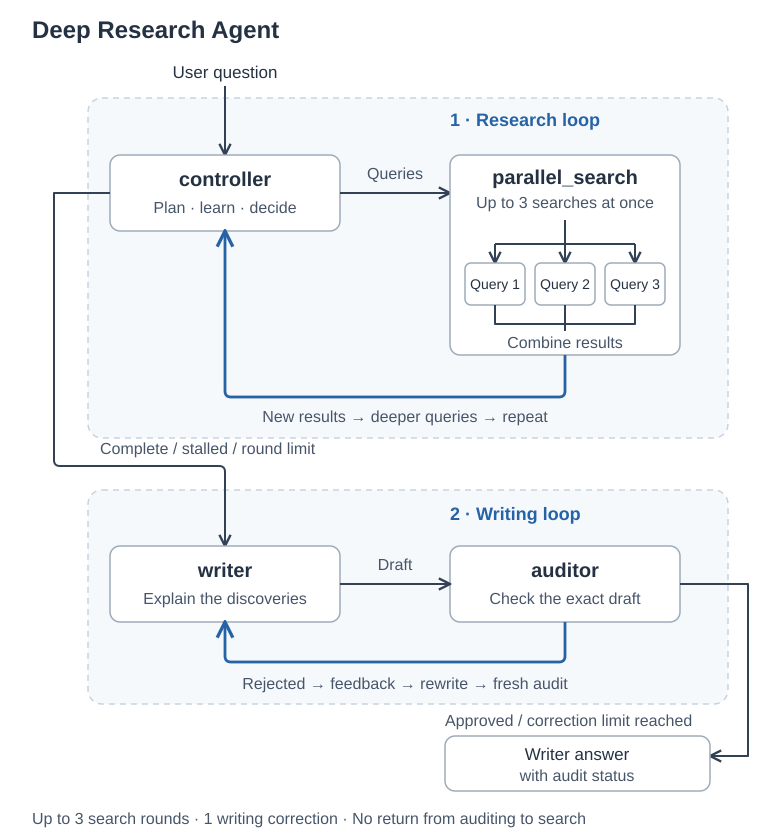
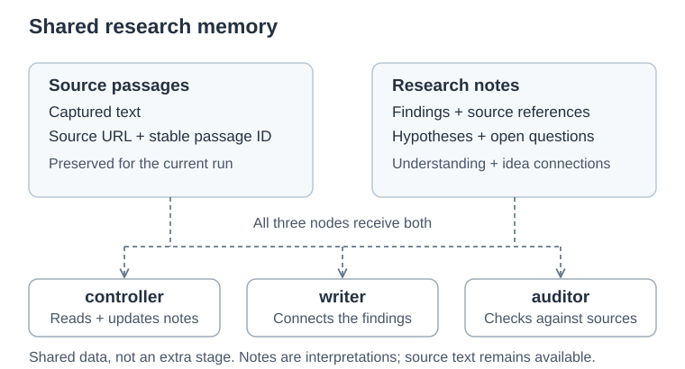

# Deep Research Agent

Deep-search agents use what they discover to decide what to investigate next, rather than answering from a single set of search results.

This agent tries to dig beyond surface-level information. It follows new findings, explores counterarguments, and uses falsification: looking for information that could show its current explanation is wrong. The writer brings the findings together into a clearly written answer with source links.

Built with LangGraph, the controller chooses search directions. Up to three queries run at the same time, and their combined results help it choose where to dig deeper. This repeats until research stops. The writer then drafts an answer, and the auditor checks it, asking for a revision if needed.

## How it works

- `controller` chooses the first searches, learns from the results, and decides where to dig deeper or when to stop.
- `parallel_search` runs up to three queries at once and combines their source text before returning to the controller.
- `writer` connects the findings into a readable answer with source links.
- `auditor` checks the draft against the sources and asks for corrections before approval.



Source text stays available throughout, and LangSmith records the run. These checks help make the work inspectable, but they do not guarantee a correct answer.

A rejected draft gets one correction and a fresh review. When the correction limit is reached, the final writer draft is shown even if audit issues remain. Unresolved audit feedback appears below the answer. The auditor does not start another search; missing information must be disclosed.

### Research memory



Captured passages keep their source URLs. Research notes distinguish findings, possible explanations, and open questions, including connections between them. The controller updates these notes; the writer and auditor receive both notes and original passages.

This is shared data, not a second executing graph. The notes are interpretations, not established truth.

## Run

Requires Python 3.12, `uv`, and API keys for OpenRouter, Exa, and LangSmith.

```bash
uv sync --locked
cp -n .env.example .env
```

Fill in the keys in `.env`, then open the notebook:

```bash
uv run jupyter lab research_agent.ipynb
```

Edit the question under **Run**, select this repo's Python environment, and run all cells. The notebook contains the full implementation.

For Colab, upload the notebook, add the three keys to Colab Secrets, and run all cells. Its setup cell installs dependencies. The workflow diagram is embedded in the notebook; no separate image upload is needed.

## Reliability safeguards

`LoopDetector` blocks repeated queries and warns the controller when a search round adds no new passages. Two consecutive stagnant rounds stop research; new passages reset the counter. This measures retrieval progress, not completeness.

Research and writing have separate stage budgets. Warnings and budget usage appear in the output.

## Settings and output

Defaults: `deepseek/deepseek-v4.1-flash`, low reasoning effort, up to three search rounds, up to three queries per round, and three results per query. Change these in the notebook settings.

Output includes the query, final writer answer and any unresolved audit issues, stop reason, retrieval issues, and a LangSmith usage report with time, tokens, and reported LLM cost. Search charges are not included. Missing trace records are reported as unavailable, not zero usage. No answer files are saved automatically.

LangSmith uses project `deep_research_agent` and the EU endpoint by default. API calls use credits, and traces record inputs and outputs. Keep sensitive information out of questions and never commit `.env`.

## Limitations

Search can miss sources, captured passages can omit context, and model-generated explanations can be wrong. The controller and auditor use the same model and may share mistakes. Approval is not proof of correctness. Memory lasts only for the current run; there is no checkpoint recovery.

Submitted by: Yousef Alyousef (يوسف اليوسف) — academy: @SDAIAAcademy
